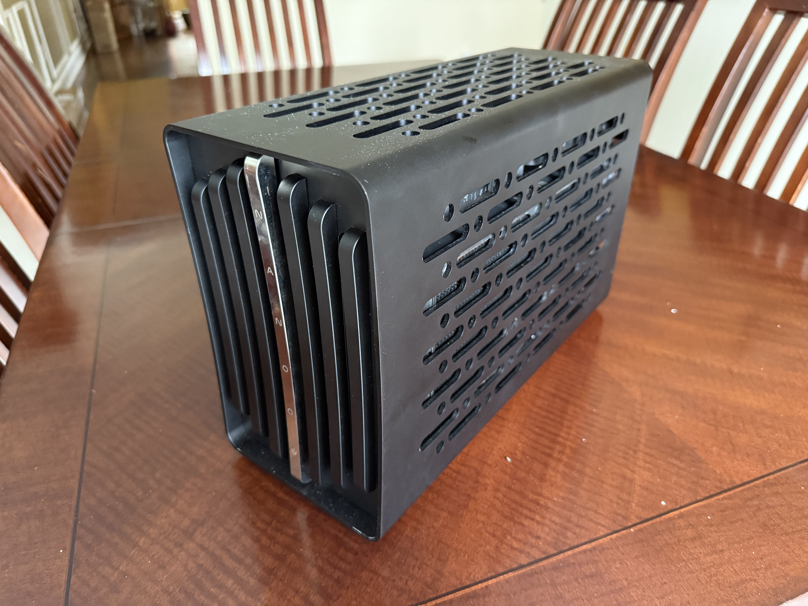

# Hackintosh EFI

  
  
  

## Parts List
- **CPU:** Intel i9-12900K
- **CPU Waterblock:** Modultra LOBO with Xylem DDC Pump
- **Motherboard:** ASRock Z790 PG-ITX/TB4
- **RAM:** G.Skill Ripjaws S5 32GB DDR5-6000
- **GPU:** PowerColor Red Devil AMD Radeon RX 6950 XT
- **GPU Waterblock:** Bykski A-PC6900XT-X
- **Storage:** Crucial T500 1TB
- **PSU:** Corsair SF750
- **Case:** NANOQ S
- **Fans:** 1x Noctua NF-A12x25, 3x Noctua NF-A12x15
- **Radiators:** 2x Barrow Dabel-20b
- **Fittings:** Various Barrow fittings
- **Quick Disconnects:** Koolance QD3
- **Tubing:** Alphacool EPDM Tube 13/10
- **Coolant:** Aquacomputer Double Protect Ultra Clear
- **Fan Controller:** Aquacomputer Quadro
- **WiFi+BT Card:** BCM94360NG
- **OS:** MacOS Sequoia, Windows 11

## Notes
- I mainly followed the [Dortania guide](https://dortania.github.io/OpenCore-Install-Guide/)
- SSDT-BRG0.aml in /EFI/oc/ACPI is used for spoofing the 6950XT to work
- I'm using [liquidctl](https://github.com/liquidctl/liquidctl) along with my fork of [eul](https://github.com/rajlulla/eul) to monitor water temp and fan speed
- I'm using this [Alder Lake guide](https://chriswayg.gitbook.io/opencore-visual-beginners-guide/advanced-topics/using-alder-lake) to get my CPU to work
- I had to set PP,PP_WorkLoadPolicyMask to 1 in my GPU DeviceProperties to reduce coil whine
